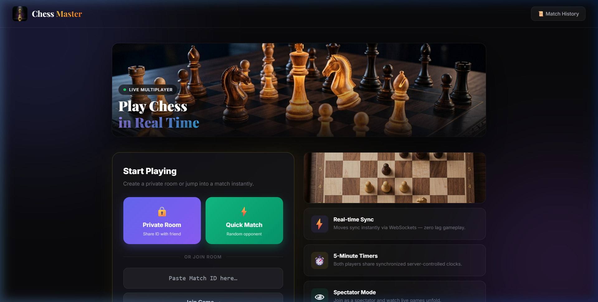
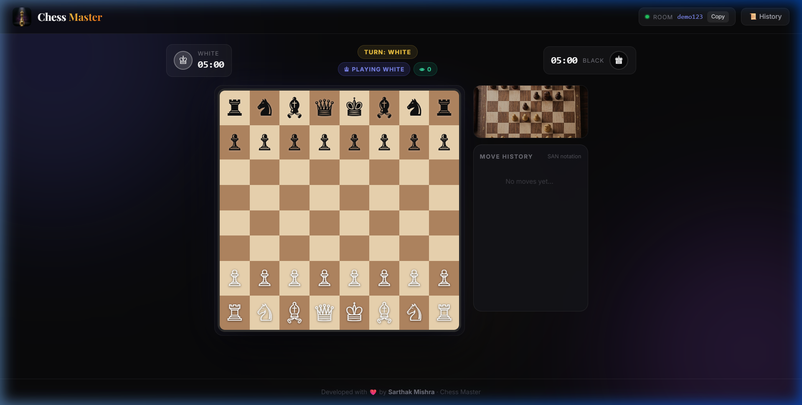
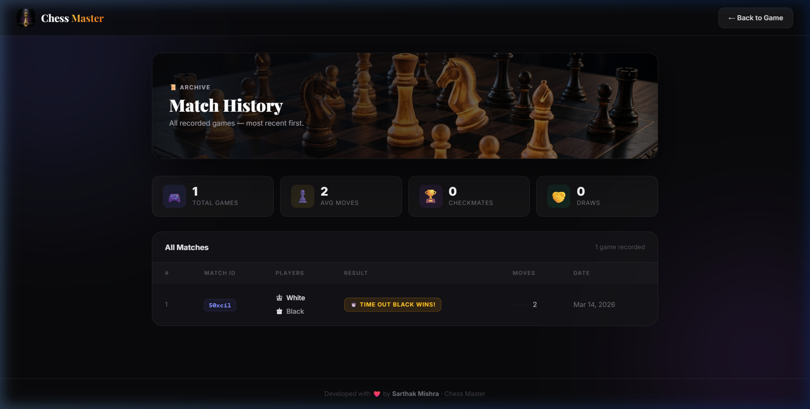

<div align="center">

# ♟️ Chess Master

live link:- https://chess-master-kguu.onrender.com/

**A premium real-time multiplayer chess app — play online, watch live, track history.**

[](https://nodejs.org/)
[](https://expressjs.com/)
[](https://socket.io/)
[](https://www.mongodb.com/atlas)
[](https://github.com/jhlywa/chess.js)
[](https://opensource.org/licenses/ISC)

</div>

---

## 📸 Screenshots

### 🏠 Lobby — Home Page
> The entry point of the app. Features a cinematic hero banner, two matchmaking options, a room-join input, and a feature overview panel.

<div align="center">
  
</div>

**What you see here:**
- 🎬 **Cinematic hero banner** with "Play Chess in Real Time" headline and a live multiplayer badge
- 🔒 **Private Room** — generates a unique 6-char room ID you can share with a friend
- ⚡ **Quick Match** — automatically pairs you with a waiting opponent via a matchmaking queue
- 📋 **Join Room** input — paste a room code to join directly
- 🃏 **Feature cards** on the right — Real-time Sync, 5-Minute Timers, Spectator Mode, Match History

---

### ♟️ Game View — Live Match
> Once inside a match room, you get a full interactive board with player info, timers, and move history side panel.

<div align="center">
  
</div>

**What you see here:**
- 🗂️ **Sticky navbar** — shows logo, live room ID badge with Copy button, and History link
- ♔ **White player card** (left) and ♚ **Black player card** (right) — each with a synchronized `MM:SS` countdown timer
- 🟡 **Turn indicator** — gold badge in the center showing whose turn it is
- 💜 **Role badge** — shows whether you're "Playing White", "Playing Black", or "Spectating"
- 🟢 **Spectator count** — live count of watchers in the room
- 🎮 **Drag-and-drop chessboard** — full 8×8 board with legal move validation
- 📖 **Move history panel** — SAN notation sidebar with alternating row styling and "No moves yet…" placeholder
- 🖼️ **Decorative board image** — top-down board art above the move history

---

### 📊 Match History — Game Archive
> A dedicated page showing all completed games, stats, and results stored in MongoDB.

<div align="center">
  
</div>

**What you see here:**
- 🎨 **Hero banner** — same cinematic chess image overlaid with "Match History" heading
- 📈 **4 stats cards** — Total Games, Avg Moves per Game, Total Checkmates, Total Draws (computed live)
- 📋 **Match table** — rows showing Match ID (clickable to filter), Players, Result badge, Move count with a visual bar, and Date
- 🏷️ **Color-coded result badges** — Purple for White wins, Pink for Black wins, Gold for Timeout, Red for Forfeit, Gray for Draw

---

## ✨ Feature Deep-Dive

### Real-time Multiplayer
- The first user to join a room becomes **White**, the second becomes **Black**
- Any further users are assigned **Spectator** role silently
- A **Quick Match queue** on the server pairs two waiting sockets automatically and redirects both to a freshly generated room

### Resilient Reconnect System
- If a player disconnects mid-game, the server **pauses the timer** and waits **30 seconds**
- Within that window, the player can refresh or reconnect and **reclaim their role** seamlessly
- If the 30s window expires, the opponent wins by **forfeit**, and the result is saved to the database

### Pawn Promotion Modal
- When a pawn reaches the back rank, a full-screen **promotion modal** opens
- Players choose from Queen ♕, Rook ♖, Bishop ♗, or Knight ♘
- The selection is sent back via WebSocket and the move is validated server-side

### Live Timers
- Each player gets a **5-minute (300s) countdown** managed by the server (`setInterval`)
- The active player's clock ticks; the other is paused
- At **< 30 seconds**, the timer text turns red and pulses as a warning
- At 0 seconds, the server emits `game_over` with a **TIME OUT** result

### Game Over & Persistence
- Detects: **Checkmate**, **Draw**, **Stalemate**, **Threefold Repetition**, **Insufficient Material**, **Time Out**, **Forfeit**
- On game over, a **modal overlay** announces the result
- The full match record (players, moves array, result, timestamp) is saved to **MongoDB** via Mongoose

---

## 🔄 App Workflow

```
User visits http://localhost:3000
        │
        ├─ Has matchId in URL? ──► YES ──► Join match room (Socket: joinMatch)
        │                                        │
        │                                        ├─ Slot 1 → Role: White ♔
        │                                        ├─ Slot 2 → Role: Black ♚
        │                                        └─ Slot 3+ → Spectator 👁
        │
        └─ NO ──► Lobby screen
                        │
                        ├─ Private Room → generate ID → share with friend
                        ├─ Quick Match  → join server queue → auto-paired → redirect
                        └─ Join Room    → paste ID → redirect to /?matchId=<id>

In-game Loop:
  Player drags piece → Socket emits "move" → Server validates (chess.js)
          │                                           │
          │                               Valid? ─► Broadcast "boardState" + "moveHistory"
          │                                           │
          └──────────────────────────────────────── All clients re-render board

Game Over:
  checkmate / draw / time out / forfeit
          │
          ├─ Emit "game_over" to room → Show modal on all clients
          └─ Save match to MongoDB (matchId, moves[], result, createdAt)
```

---

## 🛠️ Tech Stack

| Layer | Technology | Purpose |
|---|---|---|
| **Server Runtime** | Node.js | JavaScript runtime environment |
| **HTTP Framework** | Express.js | Routing (`/`, `/match-history`) and static files |
| **Real-time Layer** | Socket.io | Bi-directional WebSocket events for moves & timers |
| **Game Logic** | Chess.js | Move validation, FEN, check/checkmate detection |
| **Database** | MongoDB Atlas | Persisting completed match records |
| **ODM** | Mongoose | Schema definition & query interface for MongoDB |
| **Templating** | EJS | Server-side HTML rendering with dynamic data |
| **Styling** | Tailwind CSS (CDN) | Utility classes + glassmorphism aesthetic |
| **Client JS** | Vanilla JavaScript | Drag-and-drop, socket listeners, DOM updates |

---

## ⚙️ Setup & Installation

### Prerequisites
- [Node.js](https://nodejs.org/en/) v14 or higher
- A MongoDB instance — [MongoDB Atlas](https://www.mongodb.com/atlas) (free tier works great) or a local install

### Installation Steps

**1. Clone the repository**
```bash
git clone https://github.com/Sarthakmishra001/chess-master.git
cd chess-master
```

**2. Install dependencies**
```bash
npm install
```

**3. Configure environment variables**

Create a `.env` file in the root directory:
```env
MONGO_URI=mongodb+srv://<user>:<password>@cluster.mongodb.net/chess
PORT=3000
```
> For local MongoDB, use: `MONGO_URI=mongodb://localhost:27017/chess`

**4. Start the server**
```bash
npm start
```

**5. Open in browser**
```
http://localhost:3000
```

To play with a friend, click **Private Room**, copy the generated ID, and send it to them so they can paste it in the **Join Room** field.

---

## 📂 Project Structure

```
📦 chess-master/
├── 📁 models/
│   └── Match.js            # Mongoose schema: matchId, players, moves[], result, createdAt
│
├── 📁 public/
│   ├── 📁 images/          # App images (hero banner, chess art, screenshots)
│   └── 📁 javascripts/
│       └── chess_Game.js   # Client-side: socket listeners, board render, drag-drop, timers
│
├── 📁 views/
│   ├── index.ejs           # Main view: Lobby (no matchId) + Game board (with matchId)
│   └── match-history.ejs   # Match history page with stats and results table
│
├── app.js                  # Express + Socket.io server, game state, timer logic
├── package.json            # Dependencies and scripts
├── .env                    # Environment variables (not committed)
└── README.md               # This file
```

---

## 🤝 Developed By

<div align="center">

**Sarthak Mishra** ❤️

[](https://github.com/Sarthakmishra001)

</div>